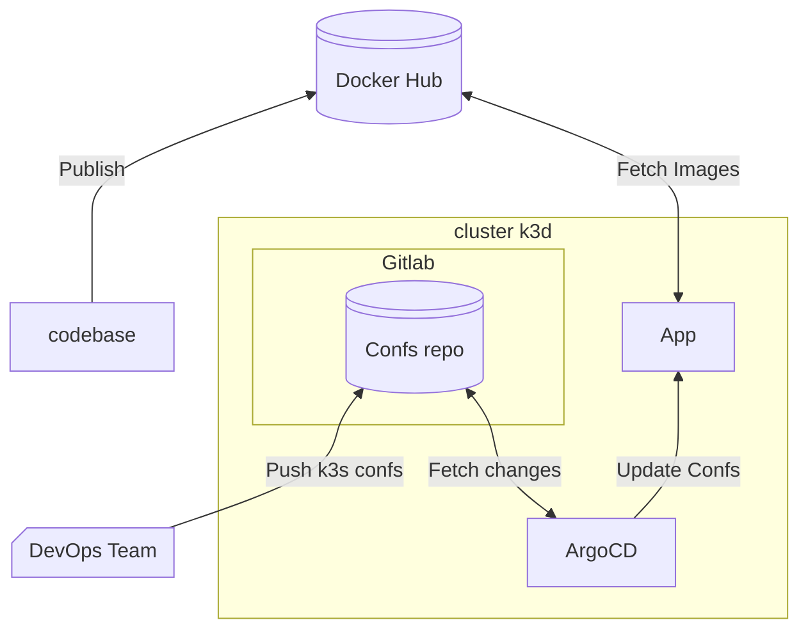

# Bonus Part

## Technos

 - K3D (Host)
 - K3S (Kubernetes Distrib)
 - ArgoCD (Continuous deployment)
 - Gitlab (Host Configs and Codebase)

## Objective



## dependencies

 - kubectl
 - docker
 - k3d
 - helm

##

```bash
./scripts/cluster.sh re
./scripts/cluster.sh demo
```
