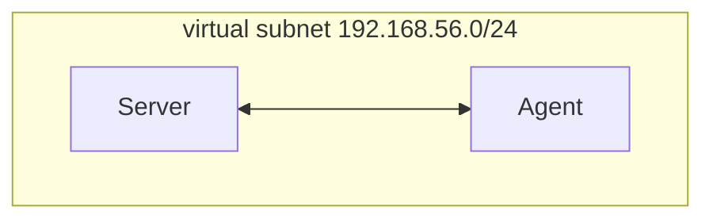
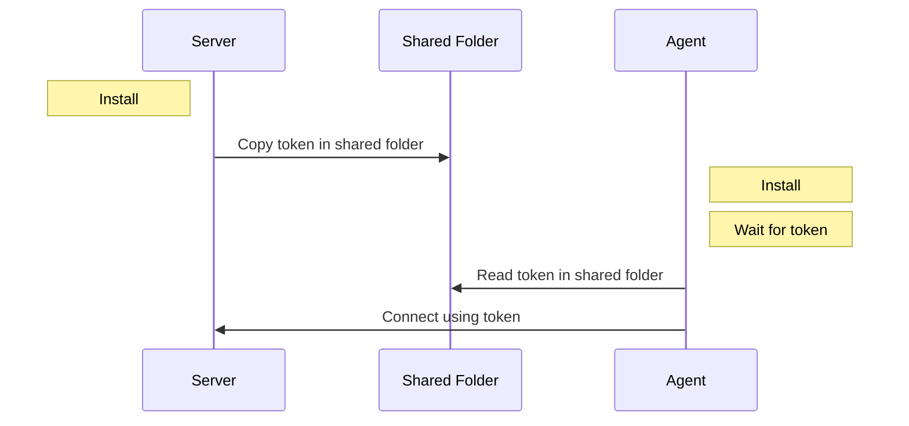

# Part 1

## Technos

 - Vagrant
 - K3S

## Objective


```mermaid
flowchart
    subgraph "virtual subnet 192.168.56.0/24"
        server[Server]
        agent[Agent]
    end
    server <---> agent
```

## Provisionning


```mermaid
sequenceDiagram
    participant server as Server
    participant shared as Shared Folder
    participant agent as Agent

    Note left of server: Install
    server ->> shared: Copy token in shared folder
    
    Note right of agent: Install
    Note right of agent: Wait for token

    agent ->> shared: Read token in shared folder
    agent ->> server: Connect using token
```

## dependencies

 - vagrant
 - Virtual Box

## Run project

```bash
$ vagrant up
```
