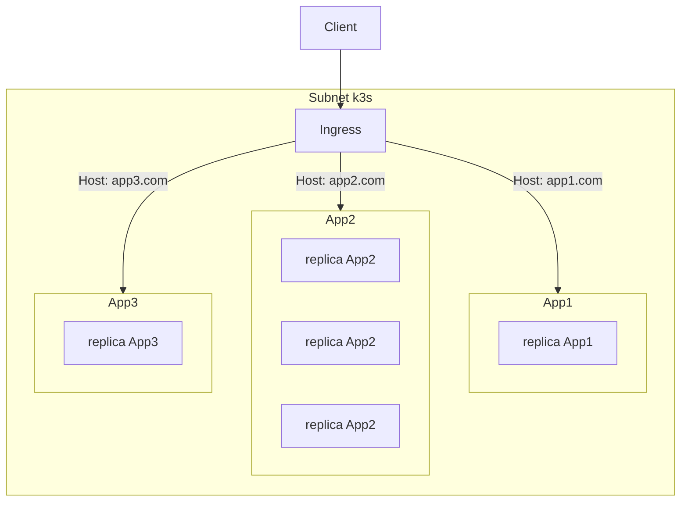

# Part 2

## Technos

 - Vagrant
 - K3S

## Objective


```mermaid
flowchart TB
    subgraph subnet[Subnet k3s]
        subgraph replicaset-app1[App1]
            replica-app1[replica App1]
        end
        subgraph replicaset-app2[App2]
            direction RL
            replica-app2-0[replica App2]
            replica-app2-1[replica App2]
            replica-app2-2[replica App2]
        end
        subgraph replicaset-app3[App3]
            replica-app3[replica App3]
        end
        ingress[Ingress]
    end
    client[Client]

    ingress -- "Host: app1.com" --> replicaset-app1
    ingress -- "Host: app2.com" --> replicaset-app2
    ingress -- "Host: app3.com" --> replicaset-app3
    client --> ingress
```

## dependencies

 - vagrant
 - Virtual Box

## Run project

```bash
$ vagrant up
```
