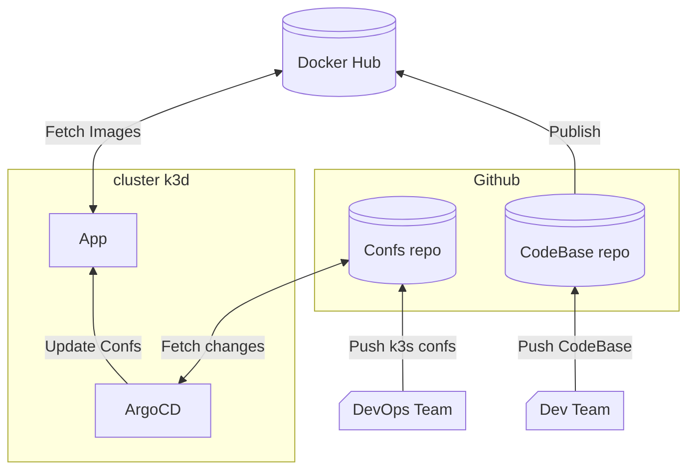

# Part 3

## Technos

 - K3D (Host)
 - K3S (Kubernetes Distrib)
 - ArgoCD (Continuous deployment)
 - Github (Host Configs and Codebase)

## Objective



## dependencies

 - kubectl
 - docker
 - k3d

## Run project

```bash
$ ./scripts/server.sh
```
